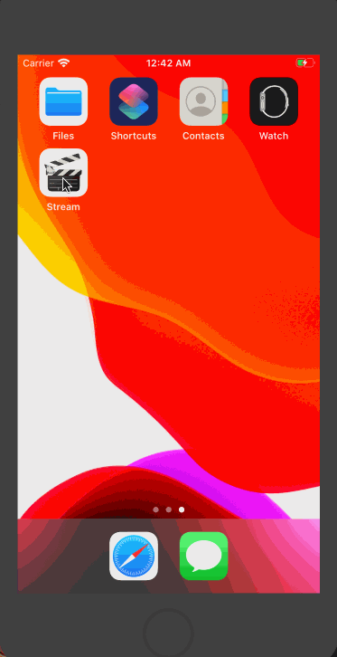
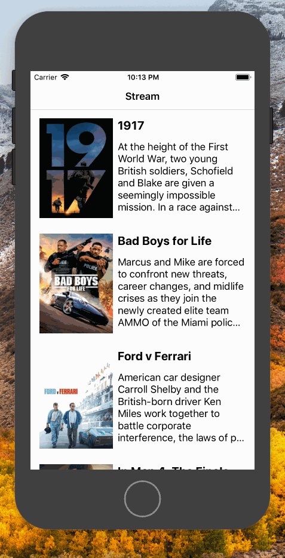

# Stream IOS Application
## Description
Flix is an app that allows users to browse movies from the [The Movie Database API](http://docs.themoviedb.apiary.io/#).

## Flix (Second Iteration)
- [x] Update User Interface
- [x] Added a movie page

---

## Flix (First Iteration)
- [x] Create a simple user interface
- [x] Pull moives from the movie database an show movies

### App Walkthough GIF

